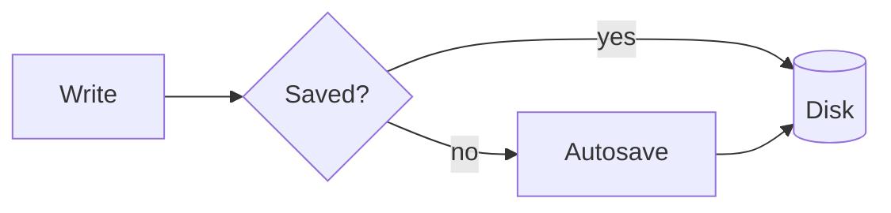
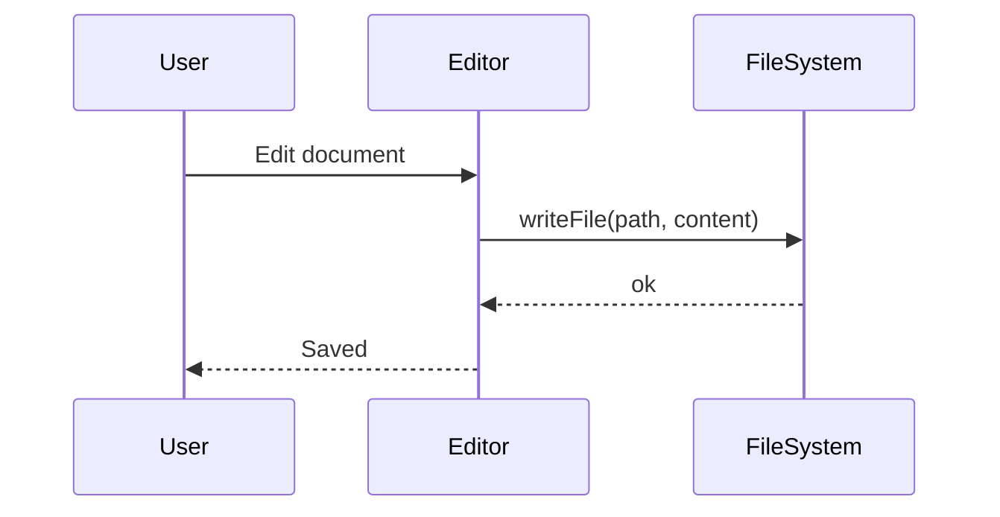
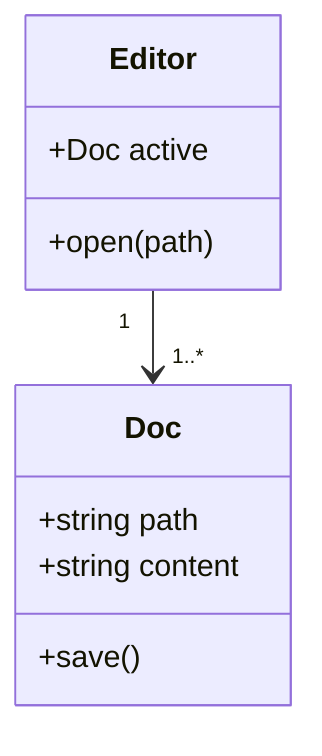
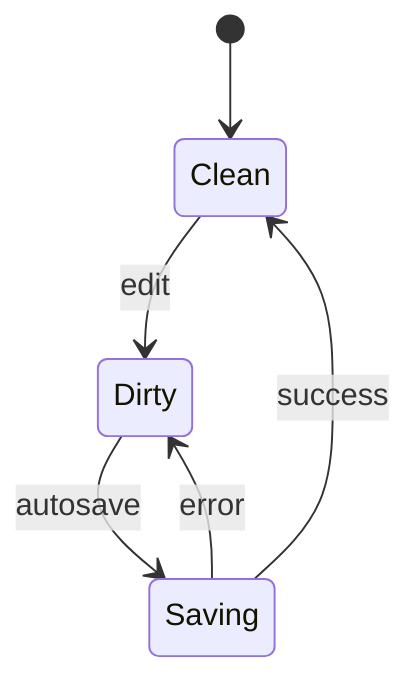
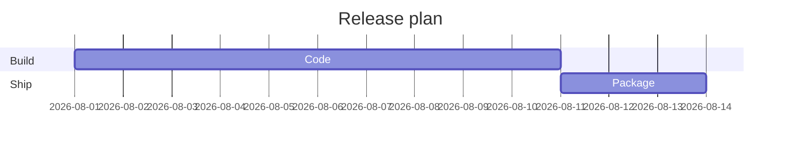
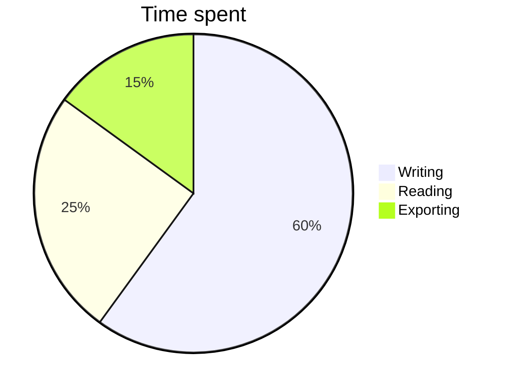

# Mermaid Diagrams

> Diagrams rendered from fenced `mermaid` blocks.

## Flowchart

```mermaid
flowchart LR
  A[Write] --> B{Saved?}
  B -- yes --> C[(Disk)]
  B -- no --> D[Autosave]
  D --> C
```

## Sequence diagram

```mermaid
sequenceDiagram
  participant U as User
  participant E as Editor
  participant FS as FileSystem
  U->>E: Edit document
  E->>FS: writeFile(path, content)
  FS-->>E: ok
  E-->>U: Saved
```

## Class diagram

```mermaid
classDiagram
  class Doc {
    +string path
    +string content
    +save()
  }
  class Editor {
    +Doc active
    +open(path)
  }
  Editor "1" --> "1..*" Doc
```

## State diagram

```mermaid
stateDiagram-v2
  [*] --> Clean
  Clean --> Dirty: edit
  Dirty --> Saving: autosave
  Saving --> Clean: success
  Saving --> Dirty: error
```

## Gantt

```mermaid
gantt
  title Release plan
  dateFormat YYYY-MM-DD
  section Build
  Code      :a1, 2026-08-01, 10d
  section Ship
  Package   :after a1, 3d
```

## Pie chart

```mermaid
pie title Time spent
  "Writing" : 60
  "Reading" : 25
  "Exporting" : 15
```
